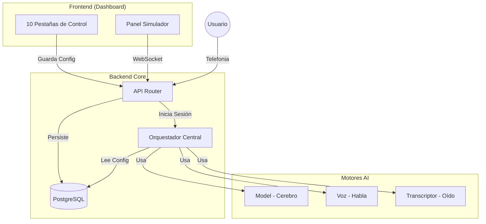

# Manual Integral del Dashboard: Asistente Andrea (V2.0)

**Validación Estricta y Completa**
**Fecha**: 03 de Febrero, 2026

Este documento constituye la referencia técnica definitiva del sistema. Desglosa los **10 Módulos de Control** verificados visual y funcionalmente.

---

## 🧠 1. Pestaña Model (Cerebro)
**Objetivo**: Configurar la inteligencia, creatividad y directrices base del asistente.

| Control | Funcionalidad | Efecto en Llamada | Utilidad | Tecnología |
| :--- | :--- | :--- | :--- | :--- |
| **LLM Provider** | Selecciona la empresa de IA (OpenAI, Groq). | Define latencia y "inteligencia". | Costo vs Calidad. | `llm_provider` |
| **Model ID** | Elige el modelo específico (GPT-4, Llama3). | Afecta razonamiento complejo. | Adaptar a complejidad. | `llm_model` |
| **Temperature** | Nivel de aleatoriedad (0.0 - 1.0). | 0=Determinista, 1=Creativo. | Controlar alucinaciones. | `temperature` |
| **System Prompt** | Instrucciones base ("Eres Andrea..."). | Define TODA la personalidad. | Reglas de negocio. | `system_prompt` |

---

## 🗣️ 2. Pestaña Voz (Identidad Acústica)
**Objetivo**: Definir cómo "suena" el asistente.

| Control | Funcionalidad | Efecto en Llamada | Utilidad | Tecnología |
| :--- | :--- | :--- | :--- | :--- |
| **TTS Provider** | Motor de síntesis (11Labs, Azure). | Realismo de la voz. | Experiencia de usuario. | `tts_provider` |
| **Voice ID** | Selección de actor de voz. | Timbre (Hombre/Mujer). | Branding. | `voice_name` |
| **Style** | Emoción (Calm, Excited). | Entonación emocional. | Empatía. | `voice_style` |
| **Speed** | Velocidad de dicción. | Ritmo de conversación. | Accesibilidad. | `voice_speed` |
| **Pitch** | Frecuencia fundamental. | Agudeza/Gravedad. | Personalización. | `voice_pitch` |

---

## 👂 3. Pestaña Transcriptor (Oído)
**Objetivo**: Configurar cómo la máquina "escucha" y procesa el audio humano.

| Control | Funcionalidad | Efecto en Llamada | Utilidad | Tecnología |
| :--- | :--- | :--- | :--- | :--- |
| **STT Provider** | Motor de reconocimiento (Deepgram). | Precisión de transcripción. | Entender acentos. | `stt_provider` |
| **Language** | Idioma esperado (es-MX, en-US). | Modelo acústico base. | Soporte regional. | `stt_language` |
| **Keywords** | Lista de énfasis (Vocabulario). | Mejora detección de jerga. | Nombres propios/Marcas. | `stt_keywords` |
| **Format** | Puntuación y Capitalización. | Texto limpio para LLM. | Mejor entendimiento. | `stt_smart_formatting` |

---

## 🛠️ 4. Pestaña Tools (Herramientas)
**Objetivo**: Capacidades funcionales y acceso a datos.

| Control | Funcionalidad | Efecto en Llamada | Utilidad | Tecnología |
| :--- | :--- | :--- | :--- | :--- |
| **Tool Switch** | Activar/Desactivar función. | Permite al LLM usarla. | Control de alcance. | `enabled_tools` |
| **Schema Editor** | Definir JSON Schema. | Estructura de datos. | Integración API. | `tool_schemas` |
| **Force Tool** | Ejecución obligatoria inicial. | Inicia flujo con acción. | Captura datos proactiva. | `force_tool` |

---

## 📢 5. Pestaña Campaigns (Campañas)
**Objetivo**: Motor de llamadas salientes masivas.

| Control | Funcionalidad | Efecto en Llamada | Utilidad | Tecnología |
| :--- | :--- | :--- | :--- | :--- |
| **CSV Upload** | Carga de base de datos. | Define a quién llamar. | Prospección masiva. | `CSVParser` |
| **Concurrency** | Hilos simultáneos. | Velocidad de barrido. | Volumetría. | `concurrency_limit` |
| **Start/Stop** | Gatillo de ejecución. | Inicia/Detiene robot. | Operación. | `CampaignManager` |

---

## 🔌 6. Pestaña Connectivity (Infraestructura)
**Objetivo**: Enlace con redes de telefonía pública (PSTN/VoIP).

| Control | Funcionalidad | Efecto en Llamada | Utilidad | Tecnología |
| :--- | :--- | :--- | :--- | :--- |
| **Telephony Provider** | Twilio vs Telnyx. | Costo y Ruta. | Redundancia. | `Env Config` |
| **SIP Trunk** | URI de conexión. | Ruta de audio. | Calidad VoIP. | `sip_trunk_uri` |
| **Recording** | Grabación legal. | Genera evidencia. | Calidad/Legal. | `enable_recording` |

---

## ⚙️ 7. Pestaña System (Gobierno)
**Objetivo**: Límites y Seguridad.

| Control | Funcionalidad | Efecto en Llamada | Utilidad | Tecnología |
| :--- | :--- | :--- | :--- | :--- |
| **Spend Limit** | Tope de gasto diario. | Freno de emergencia. | Control finanzas. | `spend_limit_daily` |
| **Privacy Mode** | Logs anónimos. | No guarda PII. | GDPR/HIPAA. | `privacy_mode` |
| **Environment** | Tag (Dev/Prod). | Segregación lógica. | Ciclo de vida. | `environment` |

---

## 🔬 8. Pestaña Avanzado (Ajuste Fino)
**Objetivo**: Calidad de experiencia y latencia.

| Control | Funcionalidad | Efecto en Llamada | Utilidad | Tecnología |
| :--- | :--- | :--- | :--- | :--- |
| **Silence Timeout** | Umbral de espera (ms). | "Paciencia" del bot. | Evitar interrupciones. | `silence_timeout_ms` |
| **Noise Supp.** | Filtro de ruido. | Limpia audio usuario. | Entornos ruidosos. | `noise_suppression_level` |
| **Audio Codec** | Compresión de audio. | Calidad vs Ancho banda. | Claridad. | `audio_codec` |
| **Backchannel** | Sonidos de escucha activa. | "Ajá", "Sí". | Humanización. | `enable_backchannel` |

---

## 📜 9. Pestaña Historial (Auditoría)
**Objetivo**: Registro forense de interacciones.

| Control | Funcionalidad | Efecto | Utilidad | Tecnología |
| :--- | :--- | :--- | :--- | :--- |
| **Listado** | Tabla de logs. | Visualización. | Monitoreo. | `SQL Select` |
| **Filtros** | Segmentación. | Búsqueda. | Análisis. | `SQL Where` |
| **Detalle** | Transcripción completa. | Lectura profunda. | QA. | `Transcript Model` |

---

## 🧪 10. Panel de Simulación (Test)
**Objetivo**: Entorno seguro de pruebas.

| Control | Funcionalidad | Efecto | Utilidad | Tecnología |
| :--- | :--- | :--- | :--- | :--- |
| **Start/Stop** | Control de Sesión. | Conecta WebSocket. | Pruebas rápidas. | `WebSocket` |
| **Visualizer** | Gráfico de audio. | Feedback visual. | Debug audio. | `Canvas API` |
| **Transcript** | Chat en tiempo real. | Feedback lógico. | Debug conversación. | `Vue Reactivity` |

---

## 🔗 Mapa de Interconexión

