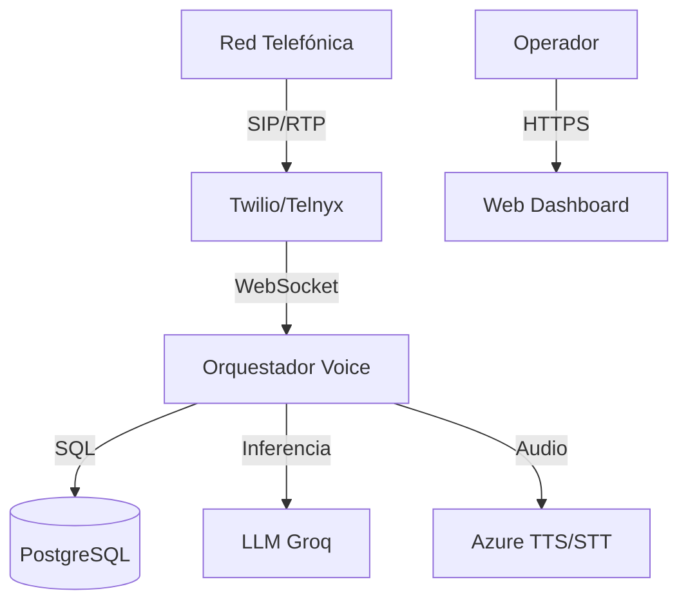

# 📖 Asistente Andrea - Manual de Producción

## 1. Introducción

**Asistente Andrea** es un orquestador de voz avanzado diseñado para automatizar llamadas telefónicas con latencia ultra-baja y comprensión de contexto humano.

### Stack Tecnológico
- **Core:** Python 3.11, FastAPI.
- **Base de Datos:** PostgreSQL 15.
- **Orquestación:** Docker Compose.
- **Frontend:** HTML5/Alpine.js (Dashboard integrado).
- **IA/ML:** Groq (Llama 3), Azure Speech Services.

### Arquitectura Simplificada


## 2. Configuración Inicial

El sistema se configura mediante variables de entorno y base de datos.

### Proveedores Requeridos
1.  **Groq:** Para inteligencia conversacional rápida.
2.  **Azure Speech:** Para voz neural (TTS) y transcripción (STT).
3.  **Twilio/Telnyx:** Para troncal SIP y números telefónicos.

### Base de Datos
La configuración del agente (prompts, voces, reglas) se almacena en la tabla `agent_configs`. El dashboard es la interfaz visual para editar esta tabla.

## 3. Uso del Dashboard

El dashboard (`/dashboard`) es el centro de control.

*   **Pestaña Modelo:** Define la personalidad (Prompt de Sistema) y parámetros del LLM.
*   **Pestaña Voz:** Selecciona la voz neural, velocidad y estilo.
*   **Pestaña Transcriptor:** Configura detección de idioma y palabras clave.
*   **Pestaña Conectividad:** Credenciales de Twilio/Telnyx y configuración de grabación.
*   **Pestaña Simulador:** Permite probar el bot usando tu micrófono antes de hacer llamadas reales.
*   **Pestaña Historial:** Muestra logs completos de todas las llamadas, incluyendo audio y JSON extraído.

## 4. Mantenimiento

### Aplicar Migraciones
Si se actualiza el código con cambios en modelos de datos:
```bash
docker compose exec app alembic upgrade head
```

### Logs
Para ver logs en tiempo real (útil para debugging):
```bash
docker compose logs -f app
```
*Busca errores marcados con ❌ o ⚠️.*

## 5. Troubleshooting (Problemas Frecuentes)

**Q: El bot contesta pero no habla.**
A: Verifica `AZURE_SPEECH_KEY` y `AZURE_SPEECH_REGION`. Si fallan, el TTS no genera audio.

**Q: La llamada se corta a los 10 segundos.**
A: Puede ser un timeout por falta de respuesta del LLM. Verifica `GROQ_API_KEY` y que el modelo seleccionado exista.

**Q: No veo llamadas en el historial.**
A: Verifica que la base de datos tenga espacio y permiso de escritura. Revisa logs de `sqlalchemy`.

**Q: "Orphaned Controls" en Health Check.**
A: Algunos controles del dashboard no se están guardando. Ejecuta el script de corrección automática o el checklist manual.

---
**Soporte:** Contactar al equipo de desarrollo responsable del repositorio.
